# Il Segreto del Carbonaro

Escape room ambientata nel Risorgimento, in **due versioni** Python:

| Versione | File | Libreria | Stile |
|---|---|---|---|
| **3D** | `il_segreto_del_carbonaro_3d.py` | [Ursina](https://www.ursinaengine.org/) (Panda3D) | Stanza 3D esplorabile in prima persona |
| **2D** | `il_segreto_del_carbonaro.py` | pygame | Punta e clicca con finestre modali |

> **Torino, 4 maggio 1860.** Sei un corriere della Carboneria, chiuso nello studio segreto di un patriota mentre i gendarmi forzano l'ingresso. Hai **15 minuti** per decifrare i codici nascosti negli oggetti della stanza, ricomporre la parola d'ordine e fuggire prima che Garibaldi salpi da Quarto.

## Versione 3D (consigliata)

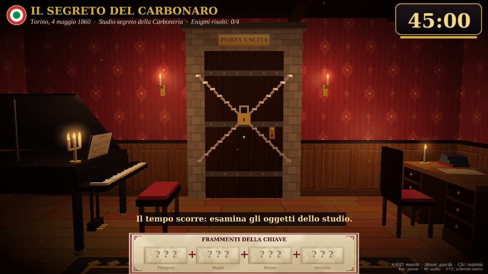

Serve Python 3.10 o superiore.

```bash
pip install ursina
python il_segreto_del_carbonaro_3d.py
```

**Comandi:** WASD / frecce per muoverti · mouse per guardarti intorno · clic sull'oggetto inquadrato dal mirino per esaminarlo · Invio per confermare · Esc per chiudere o mettere in pausa · M per l'audio · F11 per lo schermo intero · R per rigiocare a fine partita.

**Cosa contiene:**
- Studio ottocentesco esplorabile: carta da parati damascata, boiserie, parquet, travi a vista, tappeto, camino acceso con sciabole incrociate, librerie, lampadario a candele.
- Oggetti degli enigmi in 3D: pianoforte a coda con lo spartito del *Canto degli Italiani*, mappa della Spedizione dei Mille con mappamondo, ritratto del Re in cornice dorata con corona, scrivania con lettera, calamaio, penna d'oca e candela.
- Porta d'uscita sbarrata da catene e lucchetto: quando risolvi tutti gli enigmi le catene cadono. Con la parola d'ordine giusta la porta si apre e la telecamera esce verso la luce.
- Luci di candela tremolanti calcolate da uno shader GLSL scritto apposta: 6 luci per pixel con riflessi, nebbia e tone mapping.
- Gli oggetti risolti si illuminano di verde e oro, mostrano un sigillo di ceralacca fluttuante e non si possono più riaprire.
- L'orologio sul camino segna il tempo che resta.
- **Il pianoforte si può suonare**: inquadralo e premi **P** per sederti, poi suona con A S D F G H J K L (tasti bianchi: Do Re Mi Fa Sol La Si Do Re) e W E T Y U O P (tasti neri), oppure clicca direttamente i tasti. Esc per alzarti.
- **Quinto enigma, l'inno:** sul leggio c'è lo spartito dell'inizio del *Canto degli Italiani*, che Novaro compose proprio a Torino nel 1847. Suonalo per intero e ottieni un frammento della chiave. Una fila di pallini mostra quante note giuste hai suonato, e una nota sbagliata fa ripartire da capo. Nella versione 3D la parola d'ordine è quindi divisa in 5 frammenti: OB · BE · DI · S · CO.
- Musica di sottofondo di leggera suspense, composta e sintetizzata dal codice: loop in Re minore con basso pizzicato, arpeggi, archi morbidi, carillon e tic-tac, con un filtro che rende il suono più tondo.
- Il crepitio del camino è morbido e si sente di più solo quando ti avvicini al fuoco.
- Texture generate con PIL e suoni sintetizzati: nessun file esterno. Con M spegni musica ed effetti.
- Timer di 15:00 in tempo reale. Nell'ultimo minuto diventa rosso e ticchetta. Allo scadere i gendarmi sfondano la porta.

| Intro | Enigma | Mappa |
|---|---|---|
| 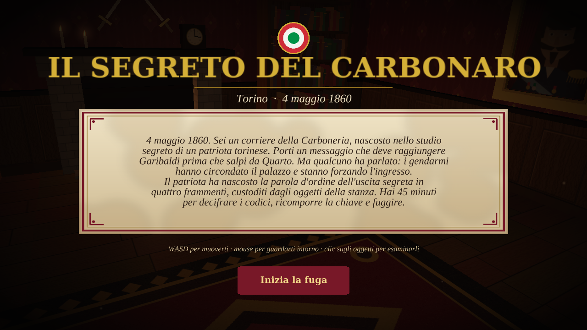 | 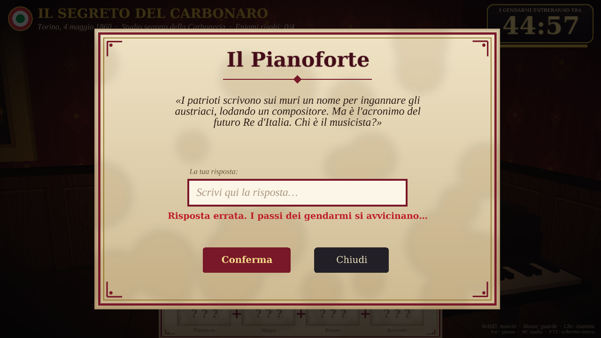 | 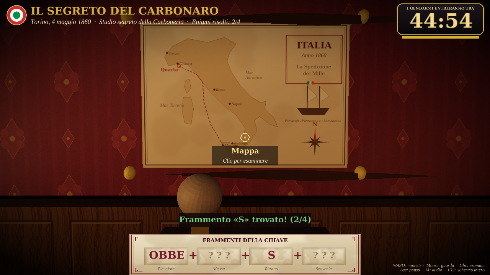 |
| **Camino** | **Vittoria** | **Game Over** |
| 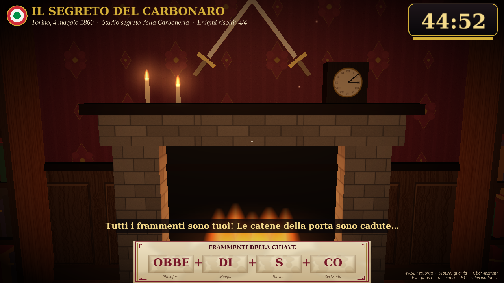 | 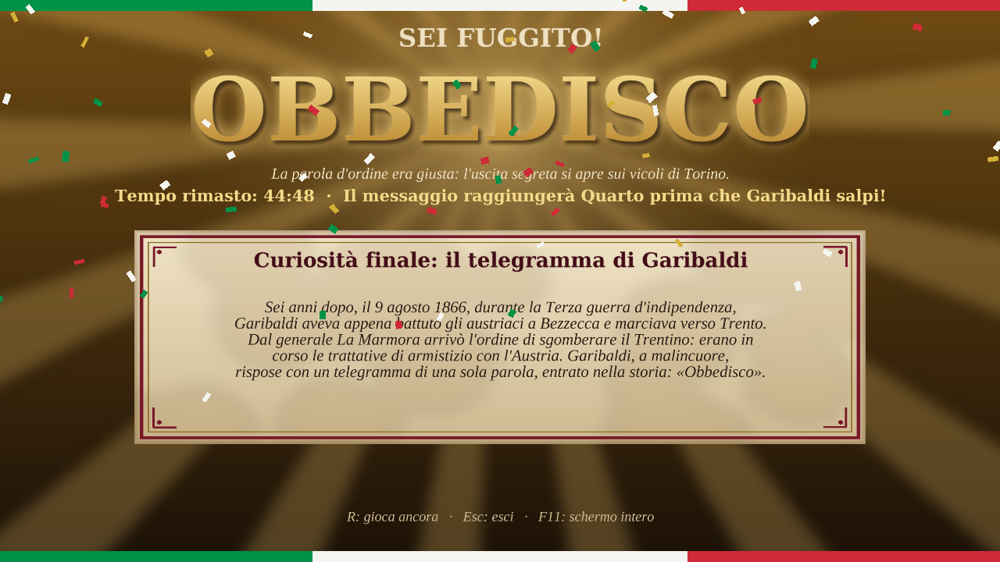 | 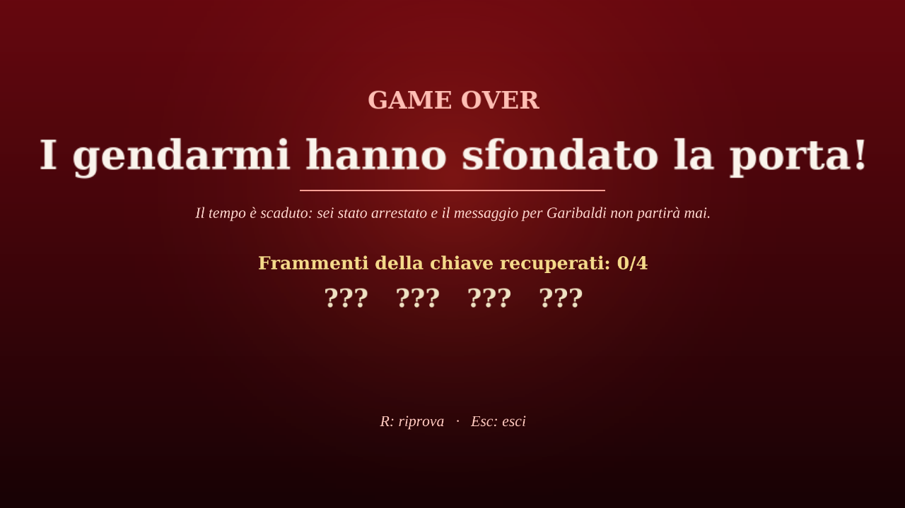 |

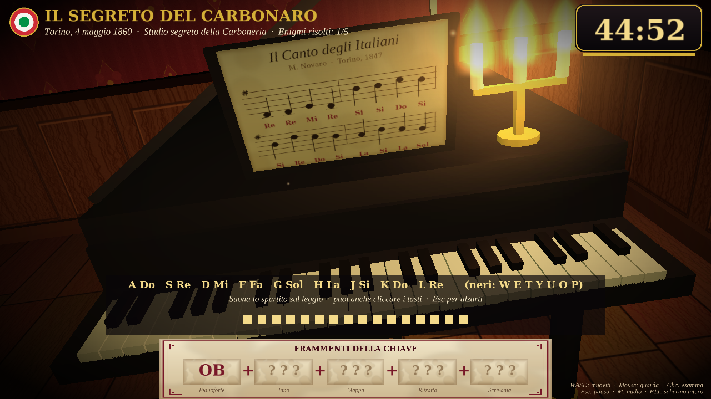

---

## Versione 2D (pygame)

### Installazione e avvio

Serve Python 3.8 o superiore.

```bash
pip install pygame
python il_segreto_del_carbonaro.py
```

(su macOS/Linux potrebbe essere `pip3` / `python3`).

Non servono altri file: grafica, font e suoni sono generati interamente via codice.
I font usati sono quelli di sistema (Georgia, Palatino, Times… con fallback automatico).

### Comandi

| Tasto / azione | Effetto |
|---|---|
| Clic su un oggetto | Apre l'enigma |
| Invio | Conferma la risposta |
| Esc | Chiude la finestra dell'enigma (a fine partita esce dal gioco) |
| M | Audio on/off |
| F11 | Schermo intero / finestra |
| R | Nuova partita (dalla schermata di vittoria o di game over) |

### Come si gioca

1. Nella stanza ci sono quattro oggetti (**Pianoforte, Mappa, Ritratto, Scrivania**) e la **Porta Uscita**.
2. Cliccando un oggetto si apre il suo indovinello. La risposta non tiene conto di maiuscole, accenti, punteggiatura e spazi in più.
3. Ogni risposta esatta sblocca un **frammento della chiave** e una **curiosità storica**. L'oggetto risolto diventa verde e oro e non è più cliccabile.
4. La porta resta sbarrata (con catene e lucchetto) finché non risolvi tutti e quattro gli enigmi.
5. Poi clicca la porta e inserisci la parola d'ordine unendo i frammenti.
6. Se il timer arriva a **00:00** prima della fuga, i gendarmi sfondano la porta: **Game Over**.

Nell'ultimo minuto il timer diventa rosso, pulsa e ticchetta.

### Caratteristiche tecniche

- **Un solo file Python** (`il_segreto_del_carbonaro.py`); unica dipendenza: `pygame`.
- **Grafica procedurale**: carta da parati damascata, boiserie, porta ad arco in pietra, pianoforte con note animate, mappa d'Italia con la rotta dei Mille, ritratto del Re, scrivania con candela tremolante, sigilli di ceralacca, polvere nella luce delle candele, vignettatura.
- **Audio sintetizzato** al volo (click, arpeggio di vittoria, errore, catene, ticchettio, fanfara, porta sfondata). Se il computer non ha una scheda audio il gioco funziona lo stesso, in silenzio.
- **Timer in tempo reale** basato sull'orologio di sistema, non sui frame: resta preciso anche se il PC rallenta. Si ferma alla vittoria.
- **Finestra ridimensionabile**: il gioco è disegnato a 1280×800 e scalato mantenendo le proporzioni. Sugli schermi piccoli la finestra si adatta da sola.
- **Input sicuro**: lunghezza massima, solo caratteri stampabili, confronto normalizzato (accenti, maiuscole, punteggiatura, spazi e congiunzione "e" ignorati).

### Screenshot

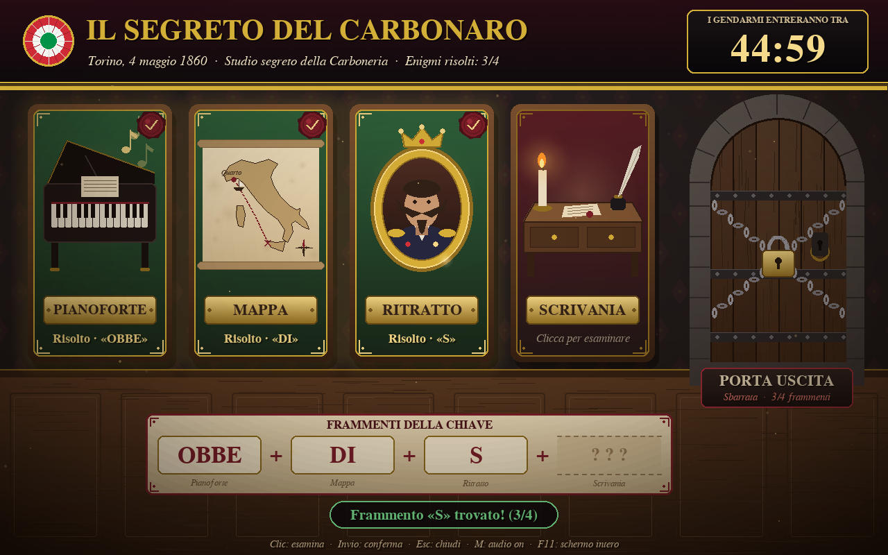

| Introduzione | Enigma |
|---|---|
| 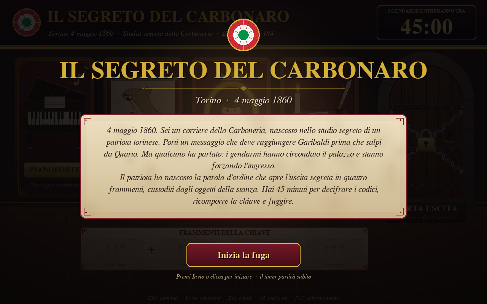 | 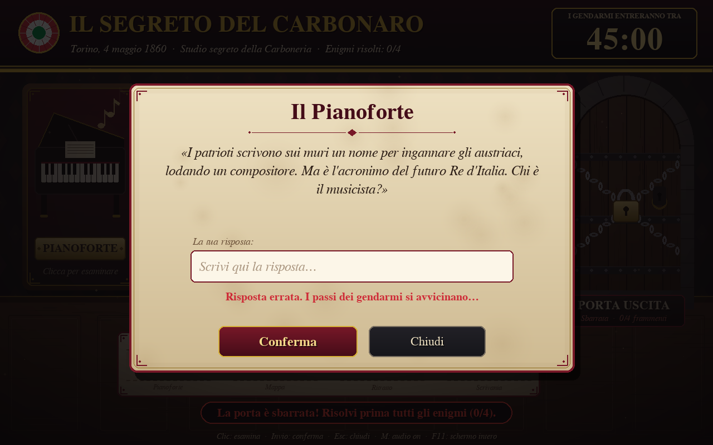 |
| **Vittoria** | **Game Over** |
| 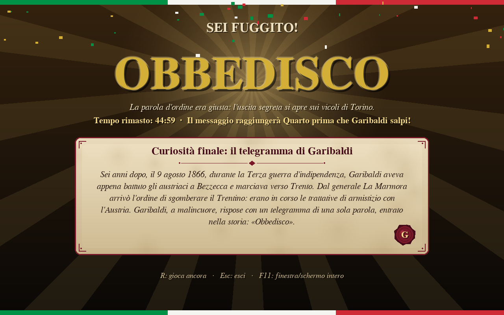 | 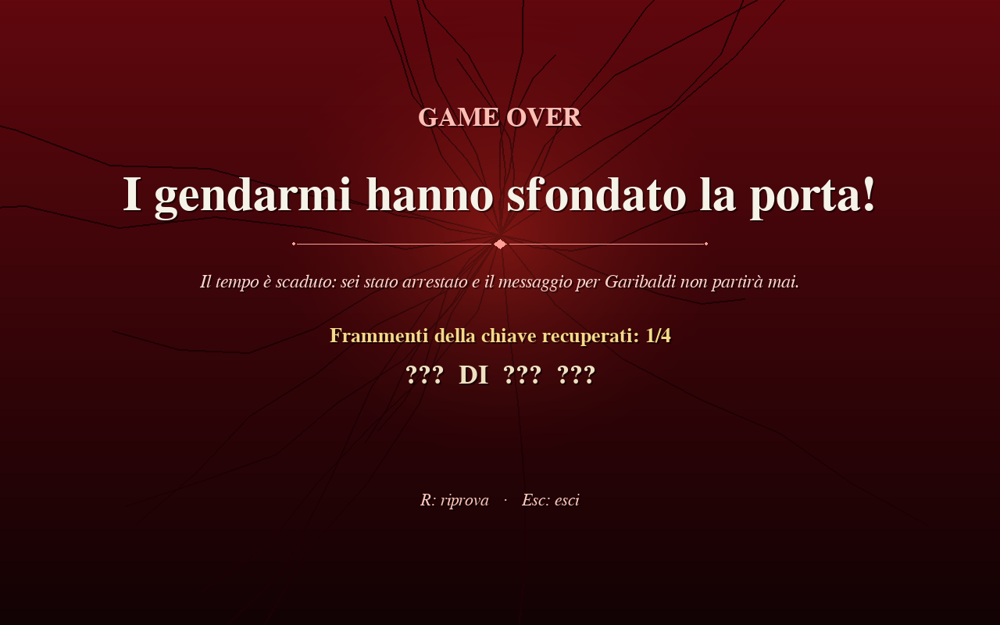 |

<details>
<summary>Soluzioni (spoiler!)</summary>

| Oggetto | Risposta | Frammento 2D | Frammento 3D |
|---|---|---|---|
| Pianoforte | VERDI | OBBE | OB |
| Inno (solo 3D) | suonare Re Re Mi Re Si Si Do Si Si Re Do Si La Si La Sol | — | BE |
| Mappa | 1089 | DI | DI |
| Ritratto | 2 | S | S |
| Scrivania | BLU BIANCO ROSSO (in qualsiasi ordine) | CO | CO |
| Porta Uscita | OBBEDISCO | — | — |

</details>
